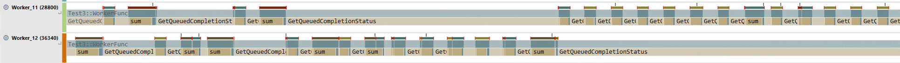
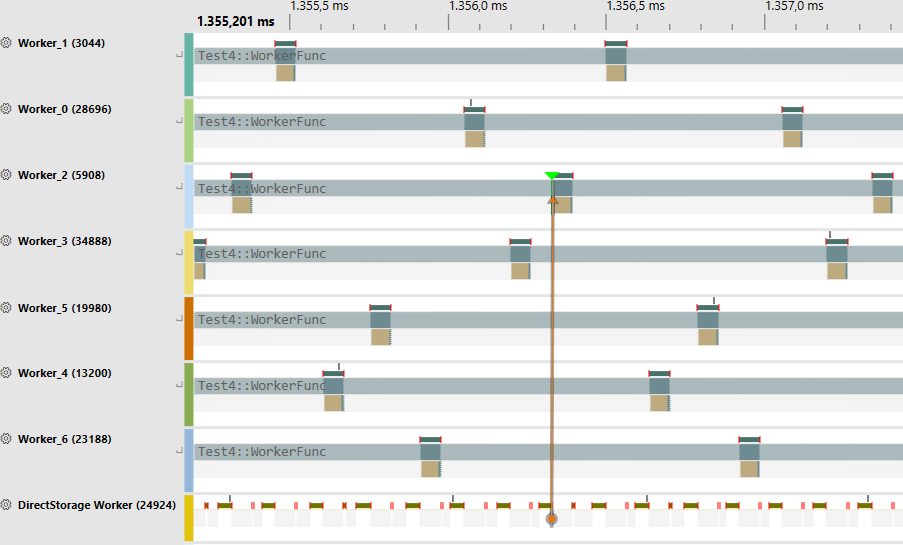

- `OVERLAPPED` IO doesn't mean it's non-blocking. When file happens to be in OS cached memory, it will serve it from cache and copy pages right away on the same thread invoking `ReadFile`, which may take long time (100-s of ms) and cause context switches. It still notifies IOCP about result.
See https://github.com/MicrosoftDocs/SupportArticles-docs/blob/main/support/windows/win32/asynchronous-disk-io-synchronous.md, which describes this behavior as well. 
File size doesn't seem to be a limitation as long as there is enough free RAM. OS is happy to serve 10 GB file at 13 GB/s, instead of 3 GB/s from disk.

- Unbuffered IO with `FILE_FLAG_NO_BUFFERING` avoids cache, but at the same time - load speed is lower (well, rather it's a real speed).

- DirectStorage also uses the same IOCP `GetQueuedCompletionStatus` on `DirectStorage Worker` thread. 
```
Line #, Process, Thread Name, Stack, Event Name, Count
10, , DirectStorage Worker, [Root], , 17789
11, , ,   |- ntdll.dll!RtlUserThreadStart, , 17759
12, , ,   |    kernel32.dll!BaseThreadInitThunk, , 17759
13, , ,   |    dstoragecore.dll!thread_start<unsigned int (__cdecl*)(void *),1>, , 17759
14, , ,   |    dstoragecore.dll!std::thread::_Invoke<std::tuple<`Win32WorkerThread::Win32WorkerThread'::`2'::<lambda_1> >,0>, , 17759
15, , ,   |    dstoragecore.dll!Win32WorkerThread::Thread, , 17759
16, , ,   |    |- dstoragecore.dll!DirectStorage::Factory::Tick, , 8988
21, , ,   |    |    |- dstoragecore.dll!DirectStorage::Factory::ProcessIOCompletions, , 32
22, , ,   |    |    |    |- dstoragecore.dll!Win32FileSystem::TryGetNextCompletionEntry, , 26
23, , ,   |    |    |    |    |- KernelBase.dll!GetQueuedCompletionStatus, , 22
```

- File API used under the hood also seems to be similar.

`factory->OpenFile` eventulally ends up in `CreateFile` with normal flags: `file_open no_intermediate_buffering non_directory_file normal shareRead` 

```
13	KernelBase.dll	CreateFileW + 0x66	0x7ff8b3aa5dd6	C:\Windows\System32\KernelBase.dll
14	dstoragecore.dll	DStorageSetConfigurationCore + 0x3603	0x7fffda7dec43	F:\code\winio\x64\Release\dstoragecore.dll
15	dstoragecore.dll	DStorageSetConfigurationCore + 0x5527	0x7fffda7e0b67	F:\code\winio\x64\Release\dstoragecore.dll
16	dstoragecore.dll	DStorageSetConfigurationCore + 0x5d9	0x7fffda7dbc19	F:\code\winio\x64\Release\dstoragecore.dll
17	WinIO.exe	Test4_DStorage + 0x2ec, F:\code\winio\WinIO\test4_dstorage.cpp(275)	0x7ff6e64e612c	F:\code\winio\x64\Release\WinIO.exe
```
Desired Access:	Generic Read
Disposition:	Open
Options:	No Buffering, Non-Directory File
Attributes:	N
ShareMode:	Read
AllocationSize:	n/a
OpenResult:	Opened

Flags seems to be same as with my IOCP call: `CreateFileA(szFilename, GENERIC_READ, FILE_SHARE_READ, NULL, OPEN_EXISTING, FILE_ATTRIBUTE_NORMAL | FILE_FLAG_OVERLAPPED | FILE_FLAG_NO_BUFFERING, NULL);`

`ReadFile` settings also seem to be the same `nocache read_operation defer_io_completion hold_device_queue` as when using `ReadFile` for overlapped iocp. 

- Captured on Windows 10, Version 10.0.19045

- Performance in my basic test is similar between IOCP and DirectStorage. DirectStorage is slightly better (but my code is probably bad).

- Thread usage pattern ends up very different:
	- `GetQueuedCompletionStatus` tends to avoid context switches and jumping between worker threads. As long as worker thread awaits for next completion status faster than disk IO, completion is likely to be served on same thread. I.e. same worker thread tends to process long sequence of completions
	

	- My DirectStorage test uses events: `EnqueueSetEvent` after each requested buffer and `WaitForMultipleObjects` on each worker thread.
	Events are signalled from `DirectStorage Worker` thread.
	```
	KernelBase!SetEvent+0xD
	dstoragecore!DirectStorage::Queue::UpdateRunningCommands+0x131
	dstoragecore!DirectStorage::Factory::UpdateRunningCommands+0x31
	dstoragecore!DirectStorage::Factory::UpdateQueues+0x1C
	dstoragecore!DirectStorage::Factory::Tick+0x5C
	```
	Unsurprisingly, events gets distributed across worker threads pretty evenly.
	

	Documentation doesn't recommend pushing an event/fence after every request and rather advices bigger batching. Although, I imagine this would work only in scenarios, when there are multiple related files/streams to load (i.e. texture set for material, big precache list with many files, some round-based loading system, etc.)

- Despite how many news were focused on NVMe in relation to DirectStorage, it works even for reads from normal hard drives. Not surprising, given it falls back onto IOCP on windows 10.

- Windows 11 has BypassIO feature https://learn.microsoft.com/en-us/windows-hardware/drivers/ifs/bypassio
It supposed to optimize kernel's code path by skipping many layers, when reading from bypassio-enabled file handle. It's unclear how userspace API looks like or how one opt-in file handle for it. Some private API or undocumented flag?
This one seems to be locked to NVMe drives.
Cannot find public benchmarks to compare its effect.
